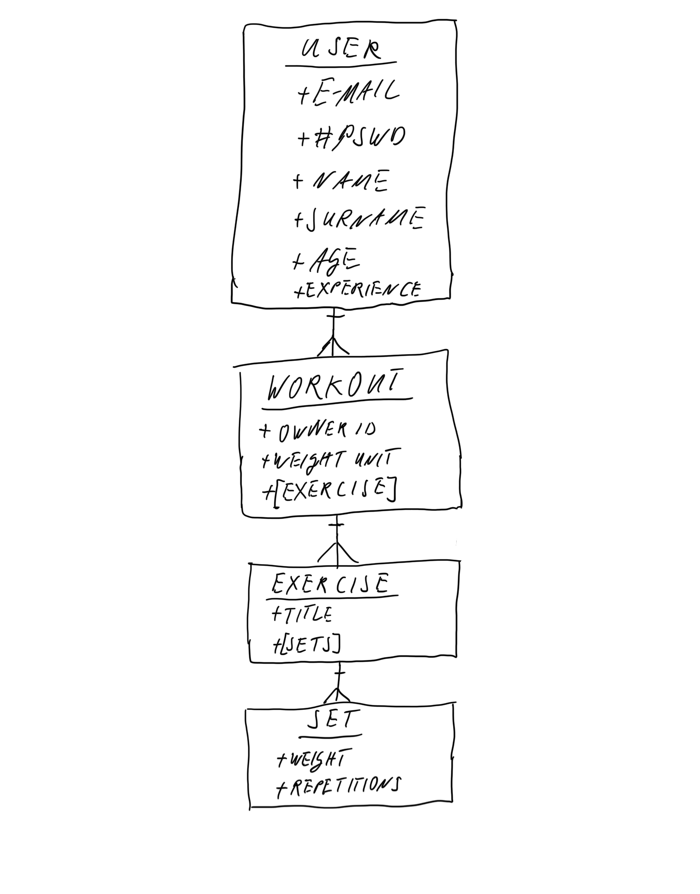

# Project: ProLoad

## Background
I want to build a workout app that reduces the interaction with the interface during the workout session to an absolute minimum. Eventually, the interaction will be limited to the mobile device/fitness band/watch asking the wearer to confirm the weight used. All the other key data points, such as repetitions, exercise, duration, heart rate are collected and stored automatically. The key USP will be the AI-driven recognition of the exercise type and the repetitions. I believe this can be achieved with 4 spatially aware sensors, each attached to the extremities of the wearer.

Whilst this is setting the scene and future development potential, this version of the app will not include the core functionality but rather resemble a bare-bones fitness tracker with mobile-first UX / UI, sign-up and sign-in functionality, and basic CRUD operations, including exercise tracking, storing, and update/review functionality.

Every fitness tracker I ever used failed to live up to the expectations because:
1. They have proved to be intrusive during the work-out - requiring cumbersome data entry or offer up a plethora of useless information that bears limited to no actionable value (e.g. staying within a certain heart rate band for cardio-vascular training)
2. Currently, available apps collect some data, but none actually offer much actionable
   advice on the back of that data

## Back-End Application
This repo is the backend of the project. It was written in Node.js and uses Express to handle the routes for the various requests. Mongoose and MongoDB are used for database storage of user data. Other libraries and frameworks include bcrypt, cors, lodash, passport, and passport-http-bearer.

## Overview of Packages
- bcrypt
- Cors
- Express
- JavaScript
- Lodash
- MongoDB
- Mongoose
- NodeJS
- Passport

## Hosted Applications

### AWS / Serverless
The app is deployed via Serverless on AWS Lambda/Gateway under the URL https://ck7k22n5j9.execute-api.us-east-1.amazonaws.com/prod/.
Deployment is actioned via the npm script `npm run deploy:serverless`.

### Render
The app was also deployed on Render. However, Render's free tier uses ephemeral server instances that shut down after some time of inactivity. Whilst that is fine in principle, 
it takes anywhere between 15-30 seconds for the instance to spin up again, leading to rather long wait times. That was the main reason for looking into serverless architecture.

## Links to Related Repositories
The front-end repo can be found on [GitHub](https://github.com/sven-gerlach/workout-tracker-client).

## Entity Relationship Diagram

The app is structured to deal with four entities, namely:

1. User: users can record their free-weights based workout
1. Workout: workouts are linked to the user through an owner_id
1. Exercise: a subdirectory of a particular workout, specifying the title of the workout
1. Set: a subdirectory of a particular exercise, specifying the weight lifted as well as the number of repetitions

## Routes
### Users

| Verb   | URI              | Body         | Headers | Status Response | Body Response    |
|--------|------------------|--------------|---------|-----------------|------------------|
| POST   | /sign-up         | credentials  | empty   | 201, Created    | user obj         |
| POST   | /sign-in         | credentials  | empty   | 200, OK         | user obj w/token |
| DELETE | /sign-out        | empty        | token   | 201. Created    | empty            |
| PATCH  | /change-password | passwords    | token   | 204, No Content | user obj w/token |
| PATCH  | /users           | user details | token   | 200, OK         | user obj         |
| DELETE | /users/:id       | empty        | token   | 204             | empty            |

#### POST Sign-up
```shell
{
  "user": {
    "_id": "604234bd95293106a28bebfd",
    "email": "rg@rg.com",
    "createdAt": "2021-03-05T13:40:13.192Z",
    "updatedAt": "2021-03-05T13:40:13.192Z",
    "__v": 0
  }
}
```

#### POST Sign-in
```shell
{
  "user": {
    "_id": "60410798b3f054e39d5b68b9",
    "email": "sg@sg.com",
    "createdAt": "2021-03-04T16:15:20.950Z",
    "updatedAt": "2021-03-05T13:42:00.356Z",
    "__v": 0,
    "token": "d655aa89a37d26fd7339df213b7acc75"
  }
}
```

#### DELETE Sign-out
```shell
'header: 204 No Content'
```

#### PATCH Change PW
```shell
'header: 204 No Content'
```

#### PATCH User details
```shell
{
  "user": {
    "_id": "604234bd95293106a28bebfd",
    "email": "rg@rg.com",
    "createdAt": "2021-03-05T13:40:13.192Z",
    "updatedAt": "2021-03-05T13:53:05.924Z",
    "__v": 0,
    "token": "1147f8d8b92c966f60aa51e7af6ee87f",
    "age": 74,
    "experience": "Rookie",
    "name": "Renate",
    "surname": "Gerlach"
  }
}
```

#### DELETE User
```shell
{
  "user": {
    "_id": "604234bd95293106a28bebfd",
    "token": "1147f8d8b92c966f60aa51e7af6ee87f"
  }
}
```

### Workouts

| Verb   | URI                            | Body         | Headers | Status Response | Body Response       |
|--------|--------------------------------|--------------|---------|-----------------|---------------------|
| POST   | /workouts                      | {}           | token   | 201, Created    | created workout obj |
| GET    | /workouts/:id                  | n/a          | token   | 200, OK         | workout obj         |
| GET    | /workouts                      | n/a          | token   | 200, OK         | workouts obj array  |
| PATCH  | /workouts/:id                  | exercise obj | token   | 201, OK         | workout obj         |
| PATCH  | /workouts/:id_w/exercise/:id_e | set obj      | token   | 201, OK         | exercise obj        |
| DELETE | /workouts/:id                  | n/a          | token   | 201, Created    | n/a                 |

#### POST Create workout
```shell
{
  "workout": {
    "_id": "60423d8739fff1075e3e5774",
    "weightUnit": "kg",
    "owner": "604234bd95293106a28bebfd",
    "exercise": [],
    "createdAt": "2021-03-05T14:17:43.980Z",
    "updatedAt": "2021-03-05T14:17:43.980Z",
    "__v": 0
  }
}
```

#### GET Find workout
```shell
{
  "workout": {
    "_id": "60423d8739fff1075e3e5774",
    "weightUnit": "kg",
    "owner": "604234bd95293106a28bebfd",
    "exercise": [],
    "createdAt": "2021-03-05T14:17:43.980Z",
    "updatedAt": "2021-03-05T14:17:43.980Z",
    "__v": 0
  }
}
```

#### GET Find all workouts
```shell
{
  "workouts": [
    {
      "_id": "60423d8739fff1075e3e5774",
      "weightUnit": "kg",
      "owner": "604234bd95293106a28bebfd",
      "exercise": [],
      "createdAt": "2021-03-05T14:17:43.980Z",
      "updatedAt": "2021-03-05T14:17:43.980Z",
      "__v": 0
    }
  ]
}
```

#### PATCH Create a new exercise
```shell
{
  "exercise": {
    "_id": "60423fad39fff1075e3e5775",
    "title": "Body weight squats",
    "sets": []
  }
}
```

#### PATCH Create a new set inside an exercise
```shell
{
  "set": {
    "_id": "6042e1e62e35d6335e31734e",
    "weight": 100,
    "repetitions": 10,
    "createdAt": "2021-03-06T01:59:02.502Z",
    "updatedAt": "2021-03-06T01:59:02.502Z"
  }
}
```


## Planning Documentation

### Planning
-[x] Review of the requirements / brief
-[x] Create User Stories
-[x] Create ERD
-[x] Create Wire Frames

### Set Up

API

-[x] Create a Github Repository
-[x] Deploy the back-end to Heroku

### API
-[x] CRUD the resources
-[x] Test resource's endpoints with curl scripts
-[x] Add the relationship to a User
-[x] Add User ownership to the resource controller
-[x] Test resource's endpoints with curl scripts

### Final Touches
-[x] README
-[x] Troubleshoot/Debug
-[x] Refactor

## Stretch Goals / Next Development Phase
1. Build in timer functionality that allows the user to record time, including total time under load, total breaks between reps and, separately, time between sets, as well as average break lengths
1. Exercise Templates
1. Review historic workout in more detail than currently possible in the graph function (which only shows total volume per exercises)
1. Combine with third-party trackers with the end-goal being that the only data point the user has to enter on their phone / smart-watch is the weights used (reps, sets, and exercises are all tracked automatically)
